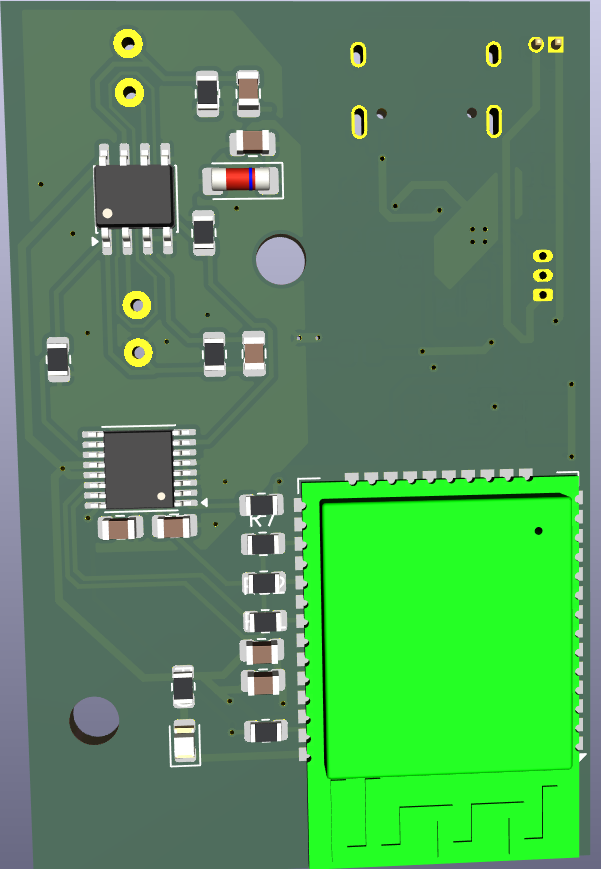
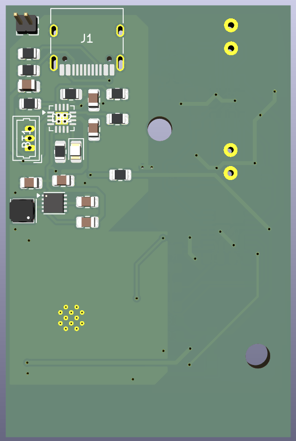
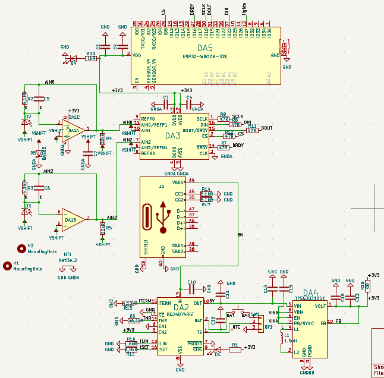
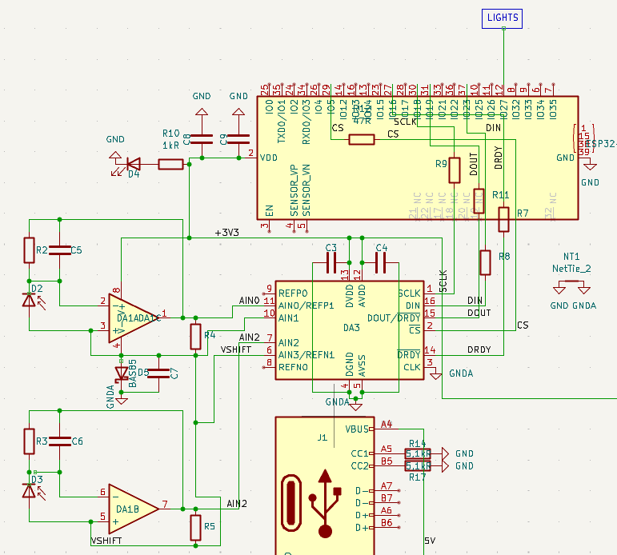
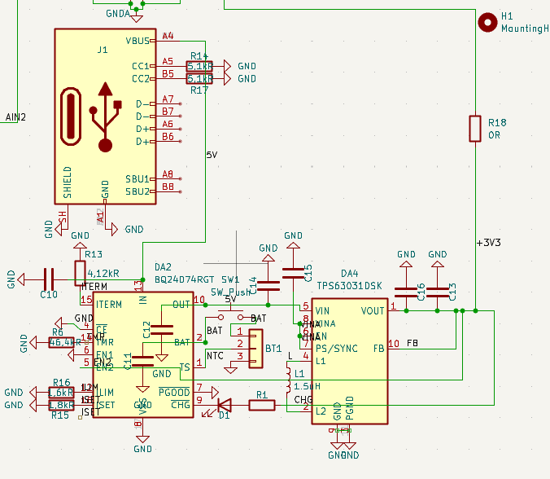

# Портативний двоканальний фотометр для LSPR

Компактна двоканальна фотометрична платформа для реєстрації та цифрової обробки сигналів двох фотодіодів.

Пристрій побудований на ESP32-WROOM-32 та 24-бітному АЦП ADS1220. Прошивка написана мовою C з використанням ESP-IDF.

## Legacy

Проєкт базується на архітектурі попереднього двоканального LSPR-фотометра на ATtiny2313(A) та ADS1242 з прошивкою на Assembly.

Поточна версія є новою апаратно-програмною реалізацією тієї ж двоканальної вимірювальної концепції на 32-бітній платформі.

## Hardware

### Основні компоненти (Core Components)

- **Мікроконтролер (MCU):** ESP32-WROOM-32
- **АЦП (ADC):** ADS1220 (24-bit Delta-Sigma)
- **Операційний підсилювач (Op-Amp):** AD8616 (Dual precision rail-to-rail, конфігурація TIA & buffer)
- **Оптичні сенсори:** 2 × Hamamatsu S1087 (кремнієві фотодіоди visible spectrum)
- **Друкована плата:** Custom PCB (2-layer board, Rev.1)
- **Живлення:** Custom low-noise power supply rail

### Реальний прототип та відладка (Physical Prototype & Bring-up)

На фото нижче зображено апаратний прототип першої ревізії (Rev.1) під час процесу першого запуску, налагодження аналогового тракту та тестування оптичного шляху (bring-up).

*Зображення 1: Прототип Rev.1 на етапі відладки.*

### 3D Рендер плати (3D Visualization)

| Top (3D) | Bottom (3D) |
| :---: | :---: |
|  |  |

*Зображення 2: 3D-візуалізація верхньої та нижньої сторін плати.*

### Трасування друкованої плати (PCB Layout)

| Верхній шар (Top Layer) | Нижній шар (Bottom Layer) | Обидва шари (Combined) |
| :---: | :---: | :---: |
|  |  |  |

*Зображення 3: Топологія шарів друкованої плати.*

### Принципова схема (Schematic)

  
🔍 <b>Повна схема (Full Schematic)</b>

   
  
  

  
🔍 <b>Аналогова частина та АЦП (Analog Frontend & ADC)</b>

   
  
  

  
🔍 <b>Вузол живлення (Power Supply)</b>

   
  
  

## Firmware

- Мова C (ESP-IDF)
- Низькорівневий регістровий драйвер ADS1220 по SPI
- Логіка двоканального мультиплексованого зчитування
- Автоматичне вимірювання темнового рівня та темнова корекція
- Цифрова фільтрація та усереднення
- Перерахунок сирих кодів АЦП у напругу (µV)
- Розрахунок співвідношення між каналами з валідацією
- Структурований CSV-вивід через UART

## Measurement pipeline

- Сигнал фотодіодів (Hamamatsu S1087)
- Каскад підсилення та буферизації (AD8616)
- 24-бітне оцифрування (ADS1220)
- Зчитування сирих кодів по SPI
- Зняття темнового рівня
- Темнова корекція (віднімання бейзлайну)
- Цифрова фільтрація та усереднення
- Перерахунок у µV
- Розрахунок співвідношення каналів (CH1 / CH2)
- CSV-вивід у UART

## Current status

Proof of Concept.

На реальному апаратному прототипі реалізовано повний двоканальний вимірювальний цикл: зчитування сигналів, темнова корекція, цифрова обробка, перерахунок у µV та розрахунок співвідношення між каналами.

Поточний етап розробки — калібрування та перевірка стабільності вимірювань.

## Known limitations

- Вимірювання ще не пройшли повну метрологічну валідацію.
- Стабільність другого каналу потребує додаткової оптимізації.
- Не завершена оптична калібровка.
- Не визначені фінальні параметри повторюваності, лінійності та шуму.

## Next steps

- Калібрування двох вимірювальних каналів.
- Перевірка стабільності та повторюваності.
- Оцінка шумів та SNR.
- Перевірка лінійності вимірювального тракту.
- Оптична калібровка за опорними зразками.
- Тестування з LSPR-чутливим елементом.
- Розробка наступної ревізії PCB (Rev.1.1).
