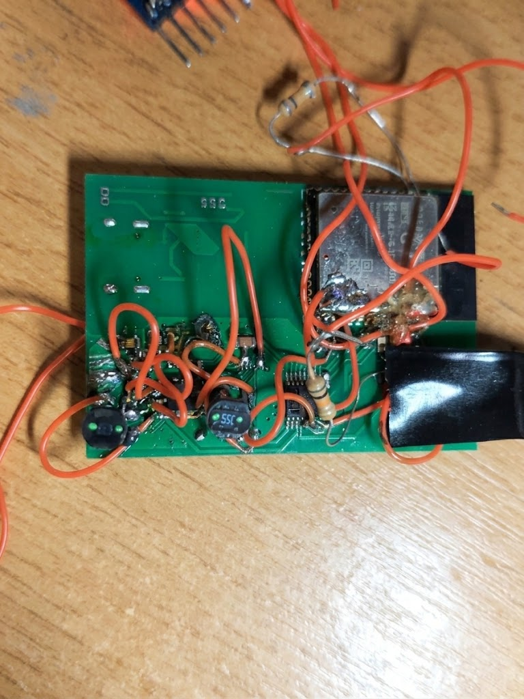
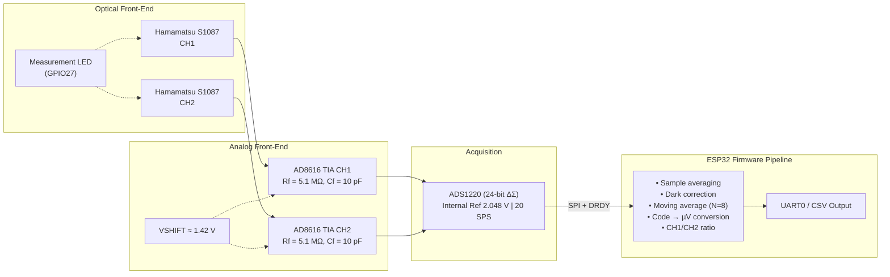

# Dual-Channel LSPR Photometer Platform

Компактна двоканальна фотометрична платформа для реєстрації та цифрової обробки сигналів фотодіодів при дослідженні локалізованого поверхневого плазмонного резонансу (LSPR).

Пристрій побудований на **ESP32-WROOM-32**, 24-бітному ΔΣ АЦП **ADS1220** та двоканальному трансимпедансному analog front-end на **AD8616**.

Поточна апаратна ревізія **Rev.1.0** є Proof of Concept та використовувалася для повного bring-up аналогового, цифрового та програмного вимірювального тракту.



---

## Hardware Overview

| Вузол | Специфікація |
|---|---|
| **MCU** | ESP32-WROOM-32 |
| **ADC** | ADS1220, 24-bit Delta-Sigma (Internal 2.048 V ref, 20 SPS, single-shot) |
| **Analog Front-End** | Dual AD8616 TIA (`Rf = 5.1 MΩ`, `Cf = 10 pF`), photovoltaic mode |
| **Bias** | `VSHIFT ≈ 1.42 V` relative to GNDA (measured on Rev.1.0) |
| **Sensors** | 2 × Hamamatsu S1087 Silicon Photodiodes |
| **Light Source** | Measurement LED switched via ESP32 GPIO27 |
| **Power** | BQ24074 charger + TPS63031 3.3 V buck-boost (shared digital/analog rail) |
| **PCB** | Custom 2-layer PCB, Rev.1.0 |
| **Status** | **Rev.1.0 PoC verified** — bring-up завершено; сформовано ТЗ на Rev.1.1 |

ADS1220 конфігурується у диференціальному режимі:
- **CH1:** `AIN0 − AIN1` (AIN1 підтягнуто до `VSHIFT`)
- **CH2:** `AIN2 − AIN3` (AIN3 підтягнуто до `VSHIFT`)

Зсув `VSHIFT ≈ 1.42 V` задає робочу common-mode точку для коректного оцифрування двополярного сигналу при однополярному живленні 3.3 В.

---

## System Architecture



---

## Firmware Overview

Прошивка реалізована мовою C під **ESP-IDF v6.0.2** для target `esp32`.

- **`ads1220`** — низькорівневий драйвер: конфігурація регістрів (`WREG`/`RREG`), контроль `DRDY`, таймінги передачі та читання 24-бітних вибірок.
- **`photometer`** — вимірювальний шар: мультиплексування каналів, віднімання темного струму (dark correction), усереднення, рухоме середнє ($N=8$) та розрахунок коефіцієнта каналів.
- **`photometer_output`** — пакетування та потоковий вивід даних у UART.
- **`main`** — секвенсер калібрування, керування оптичним джерелом та запуск циклу вимірювань.

---

## Quick Start

### Build & Flash

```bash
# Встановлення цільового чіпа та збірка
idf.py set-target esp32
idf.py build

# Прошивка та монітор (Windows: COMx, Linux/macOS: /dev/ttyUSBx)
idf.py -p COM7 flash monitor
```

*Примітка:* Розпіновка SPI та системних інтерфейсів зафіксована у коді Rev.1.0; деталі наведено у [Hardware Architecture & Pinout](docs/hardware.md).

---

## Data Output

Вимірювання транслюються через `UART0` у CSV-подібному форматі:

```text
DATA,40004171,26,1043353,1031889,11464,2798.828,11595,2830.811,204278,682426,-478148,-116735.352,-473754,-115662.598,-0.023976,-0.024475,1,1,0,0
```

Кожен рядок фіксує сирі коди обох каналів, значення темного зміщення, скориговані сигнали в $\mu\text{V}$, результат фільтрації, обчислене співвідношення та статус-прапорці saturation/validity.

Повний лог першого запуску: [**rev1_ads1220_bringup_log.csv**](docs/logs/rev1_ads1220_bringup_log.csv)

Структура полів та опис даних: [**Data Format & Bring-up Logs**](docs/logs/README.md)

> Дані першого запуску демонструють стабільну роботу цифрового SPI-тракту після усунення апаратних збоїв шини і не є метрологічно каліброваними.

---

## Limitations & Rev.1.1 Requirements

На ревізії Rev.1.0 зафіксовано апаратні обмеження, що увійшли до плану модернізації:

1. **Шум живлення:** Спільна шина 3.3 В від імпульсного перетворювача TPS63031 безпосередньо впливає на аналоговий тракт. Для Rev.1.1 закладено виділений ultra-low-noise LDO.
2. **Топологія AFE:** Відсутність виділеного guard ring навколо високоомного кола фотодіодів ($R_f = 5.1\,\text{M}\Omega$).
3. **Debug & Programming:** Відсутність розведеного окремого роз'єму для UART/EN/BOOT на платі.
4. **Метрологія:** Довготривалий дрейф, SNR, лінійність та повторюваність вимірювань перенесені на стендове тестування ревізії Rev.1.1.

---

## Documentation

- **Hardware:** [Hardware Architecture & Pinout](docs/hardware.md) · [Hardware Errata](docs/ERRATA.md)
- **Firmware:** [Firmware Implementation & Notes](docs/firmware.md) · [Firmware Errata](docs/FIRMWARE_ERRATA.md)
- **Experimental Data:** [Data Format & Bring-up Logs](docs/logs/README.md)

---

## Legacy

Архітектура приладу розвиває концепцію двоканального LSPR-фотометра на базі **ATtiny2313(A)** та **ADS1242** (Assembly), реалізуючи аналогічний диференціальний оптичний принцип на сучасному 32-бітному ядрі ESP32.