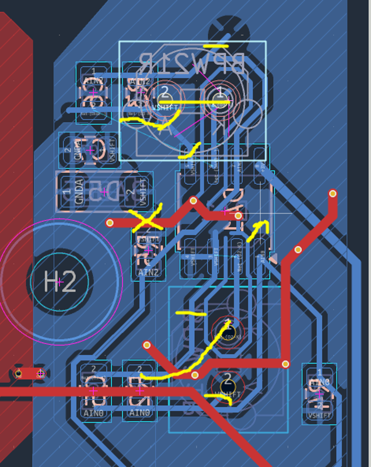

# Hardware Errata & Bring-up Log (Rev.1.0)

Документація апаратних проблем ревізії Rev.1.0, тимчасових доробок Bring-up та вимог до редизайну топології друкованої плати Rev.1.1.

---

## 1. Апаратна частина (Hardware Errata & Fixes)

### Аналоговий тракт (TIA, Guard Ring & Bias)
* **Помилка з'єднання OUT/AIN з VSHIFT:**
  * *Проблема:* Вихід ОУ/вхід АЦП був помилково закорочений на лінію `VSHIFT`.
  * *Rev.1 Fix:* Зайвий зв'язок перерізано скальпелем. Ланцюг зворотного зв'язку ($R \parallel C$) залишено суворо між виходом та інвертуючим входом ОУ. Потенціал `VSHIFT` заведений на неінвертуючий вхід та анод фотодіода.
  * *Rev.1.1:* Виправити трасування зворотного зв'язку ТІУ в KiCad.
* **Замикання AIN0 ↔ VSHIFT у вузлі фотодіодів:**
  * *Проблема:* Замикання надлишковою міддю в зоні фотодіодного вузла.
  * *Rev.1 Fix:* Зайві ділянки міді зачищені/відсічені, необхідний зв'язок відновлено перемичкою МГТФ.
  * *Rev.1.1:* Перерозвести фотодіодний вузол з дотриманням зазорів.
* **Розрив полігону/траси VSHIFT:**
  * *Проблема:* Мережа `VSHIFT` виявилася фізично розірваною на дві незв'язані частини.
  * *Rev.1 Fix:* З'єднано перемичкою МГТФ з наскрізним продзвонюванням.
  * *Rev.1.1:* Відновити цілісність полігону `VSHIFT`.
* **Топологія Guard Ring:**
  * *Проблема:* Охоронне кільце було помилково посаджене на `GNDA`, що створювало струми витоку через різницю потенціалів із $V_{shift}$.
  * *Rev.1.1:* Перевести Guard Ring (або суцільний захисний полігон) під аналоговим вузлом виключно на потенціал `VSHIFT`.

#### Схема перекройки аналогового вузла ТІУ та Guard Ring:

---

### Трасування АЦП, Зазори та Компонування
* **Критичні зазори TSSOP-16 (ADS1220):**
  * *Проблема:* Траси `DIN`, `DOUT`, `DRDY` розведені занадто щільно до паяльних падів і живлення 3V3. Найменше пошкодження маски під час ручного паяння викликало КЗ та вихід АЦП з ладу.
  * *Rev.1.1:* Збільшити clearance навколо ADS1220, відвести цифрові сигнальні траси від силових полігонів.
* **Тісне компонування компонентів:**
  * *Проблема:* Резистори 47 Ом змонтовані впритул до модуля ESP32; роз'єм Molex акумулятора перекриває доступ до BQ24074.
  * *Rev.1.1:* Збільшити габарити плати (орієнтовно в 1.5 раза) для нормального доступу до вимірювальних вузлів та легшого монтажу.
* **Помилки пасивних компонентів (R6, C14):**
  * *Проблема R6:* Відсутній зв'язок одного з падів із землею. (Виправлено перемичкою GND; у Rev.1.1 додати штатне via).
  * *Проблема C14:* Помилкове підведення 5V до GND-паду через термобар'єр (пряме КЗ 5V ↔ GND). (Виправлено відсіканням траси 5V; у Rev.1.1 прибрати хибну доріжку).

---

### Цифровий вузол та Оптична ізоляція
* **Паразитна оптична засвітка від світлодіода:**
  * *Проблема:* Статусний LED розташований на верхній стороні плати поруч із фотодіодами Hamamatsu.
  * *Rev.1 Fix:* Заклеювання ізоляційною стрічкою.
  * *Rev.1.1:* Перенести світлодіоди індикації на зворотний (нижній) бік плати.
* **Інтерфейс прошивки та Reset-ланцюги ESP32:**
  * *Проблема:* Відсутність контактних майданчиків під `EN`, `GPIO0`, `TX0`, `RX0`. Внутрішніх подтяжек кристалла недостатньо для стабільного перемикання станів (довелося навісним монтажем ставити резистори 10 кОм до 3V3).
  * *Rev.1.1:* 
    * Додати штатний UART-роз'єм (GND, TXD, RXD, EN, GPIO0).
    * Встановити зовнішній RC-ланцюг на `EN` (pull-up 10 кОм + 1–10 мкФ на GND) та pull-up 10 кОм на `GPIO0`.
    * Додати окремий діагностичний LED на лінію `GPIO0` для індикації режиму Bootloader.
* **Маска мідних ділянок:**
  * *Rev.1.1:* Наглухо закрити маскою всі незадіяні мідні полігони для уникнення антенного ефекту від RF-тракту ESP32.

---

## 2. Програмні воркараунди (Firmware Workarounds)

*Тимчасові модифікації коду, внесені для компенсації апаратних дефектів Rev.1.0:*

* **Програмний Pull-up для сигнальних ліній:** Конфігурація внутрішніх підтяжок `GPIO_PULLUP` в ESP-IDF для компенсації відсутності зовнішніх резисторів на окремих цифрових лініях.
* **Затримки живлення при старті:** Додано програмні паузи перед опитуванням SPI-регістрів АЦП для стабілізації перехідних процесів на шині живлення.