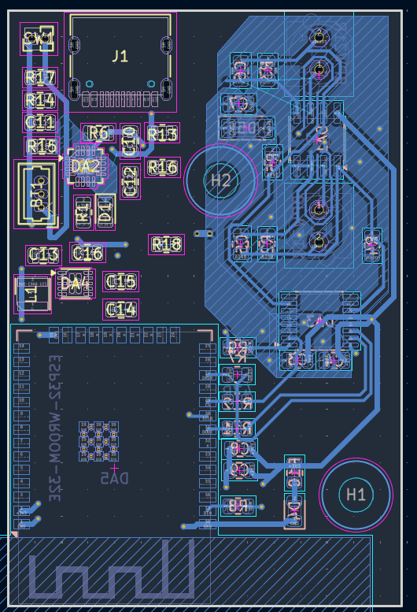
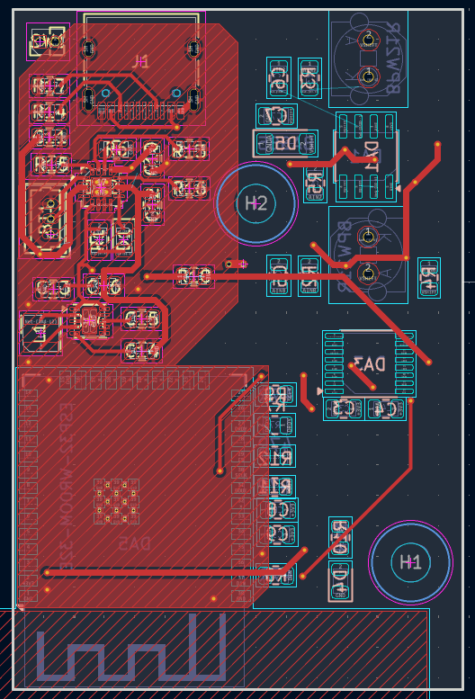
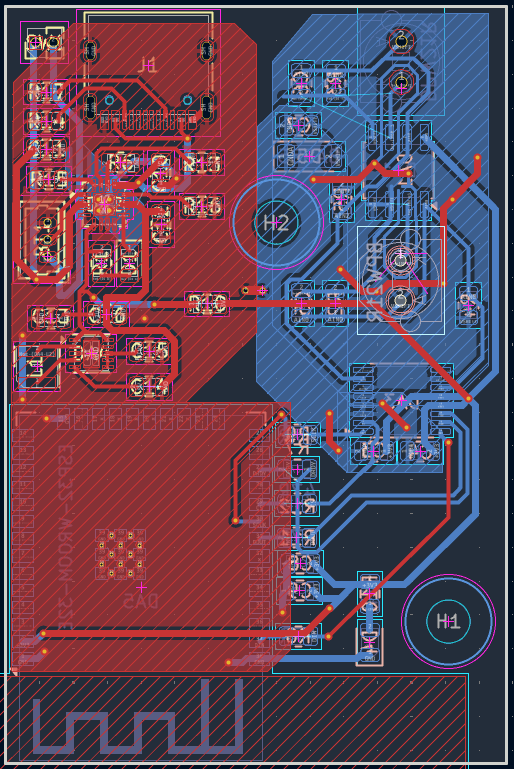

# Апаратна архітектура та Errata (Rev.1.0)

## Аналоговий Front-End та Pinout

- **TIA:** AD8616 dual op-amp (`Rf = 5.1 MΩ`, `Cf = 10 pF`), photovoltaic mode.

- **Bias:** `VSHIFT ≈ 1.42 V` відносно GNDA для псевдодиференціального двополярного розмаху сигналу при однополярному живленні 3.3 V.

- **Сенсори:** 2 × фотодіоди Hamamatsu S1087.

- **Живлення:** BQ24074 charger + TPS63031 buck-boost зі спільною цифровою та аналоговою шиною живлення.

### Pin Mapping

| Периферія | Сигнал | ESP32 GPIO | Напрямок |
|---|---|---:|---|
| ADS1220 | CS | GPIO5 | Output |
| ADS1220 | DRDY | GPIO16 | Input |
| ADS1220 | SCLK | GPIO18 | Output |
| ADS1220 | DOUT | GPIO19 | Input |
| ADS1220 | DIN | GPIO23 | Output |
| Control | LED Trigger | GPIO27 | Output |
| Debug | UART0 TX / RX | GPIO1 / GPIO3 | — |

---

## Відомі проблеми та вимоги до Rev.1.1

- **Шина живлення:** Аналоговий front-end та ADC у Rev.1.0 живляться безпосередньо від спільної шини 3.3 V, сформованої TPS63031, без окремого low-noise post-regulation stage. Через це switching ripple та цифрові завади шини живлення потенційно можуть проникати у прецизійний аналоговий тракт.  
  *Rev.1.1:* Додати окреме малошумне живлення аналогового домену із застосуванням LDO або відповідного post-regulation / filtering stage з достатнім запасом напруги.

- **Guard Ring:** У Rev.1.0 guard structure була прив'язана до `GNDA` замість потенціалу `VSHIFT`, відносно якого працює високоімпедансний вузол TIA.  
  *Rev.1.1:* Перерозвести guard навколо високоімпедансних вузлів фотодіода/TIA та прив'язати його до `VSHIFT`, враховуючи паразитну ємність під час PCB layout.

- **Debug:** У Rev.1.0 не було передбачено окремого UART programming/debug header або JTAG access header.

- **Метрологія:** Довготривалий аналоговий дрейф, SNR та оптична лінійність мають бути валідовані на Rev.1.1.

## Рендери PCB Layout

<figure>
  
  <figcaption align="center"><em>Рисунок 1 — Трасування верхнього шару (Top Layer): аналоговий тракт TIA, АЦП та обв'язка ESP32</em></figcaption>
</figure>

<figure>
  
  <figcaption align="center"><em>Рисунок 2 — Трасування нижнього шару (Bottom Layer): суцільний полігон землі (GND plane) та силові ланцюги</em></figcaption>
</figure>

<figure>
  
  <figcaption align="center"><em>Рисунок 3 — Комбінований вигляд шарів (Top + Bottom): взаємне розташування трас і перехідних отворів</em></figcaption>
</figure>